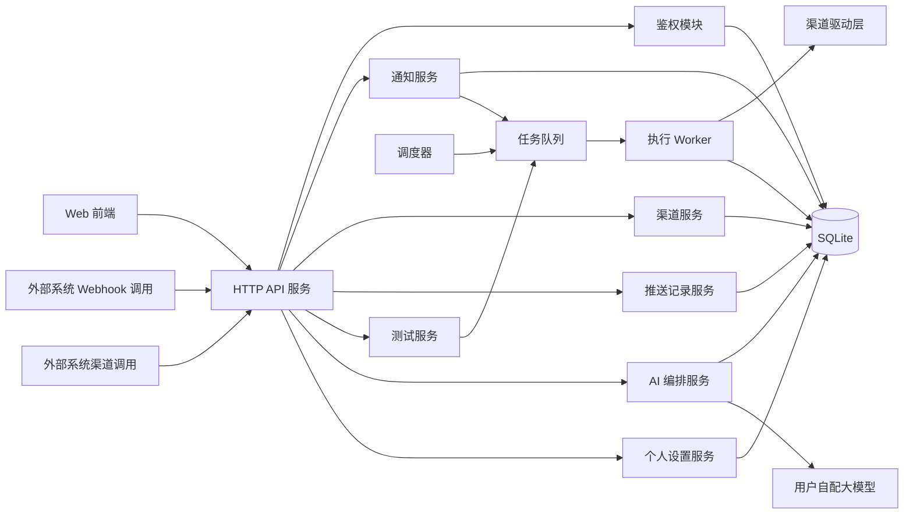
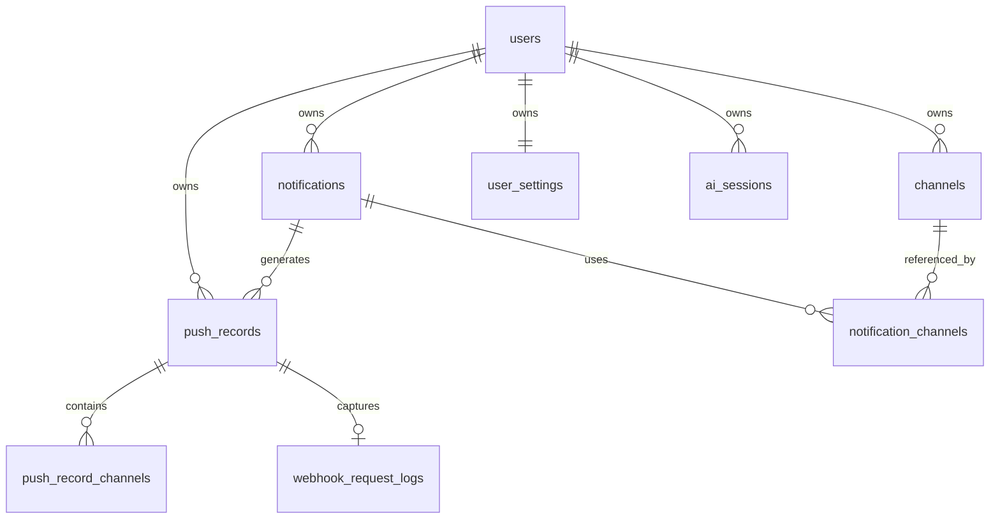
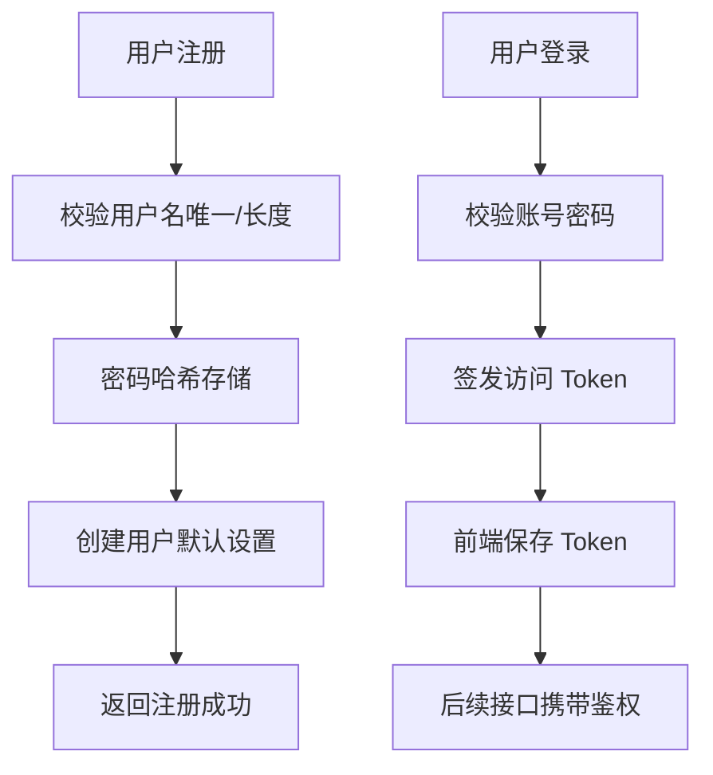
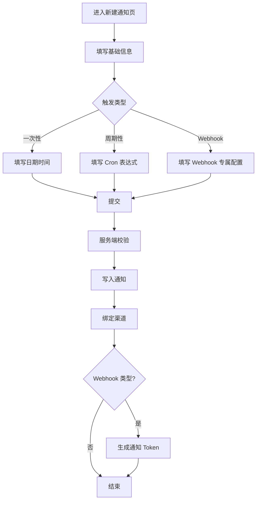
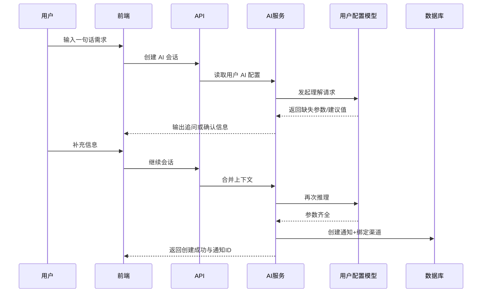
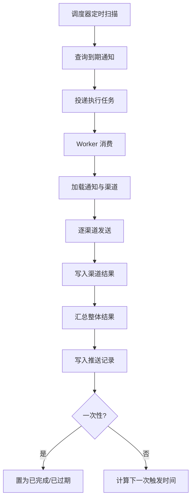
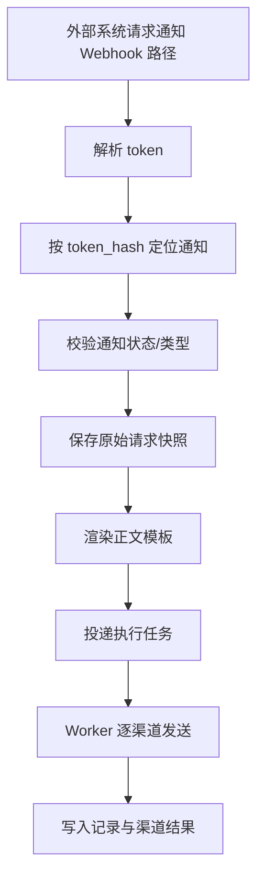
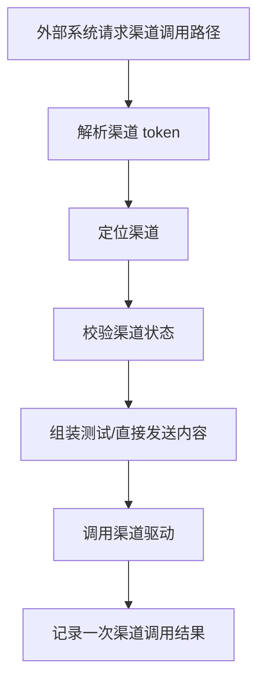
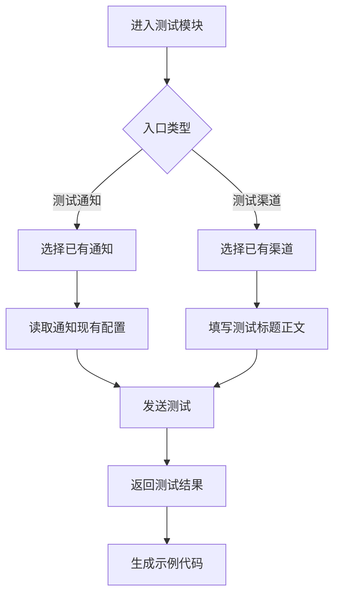
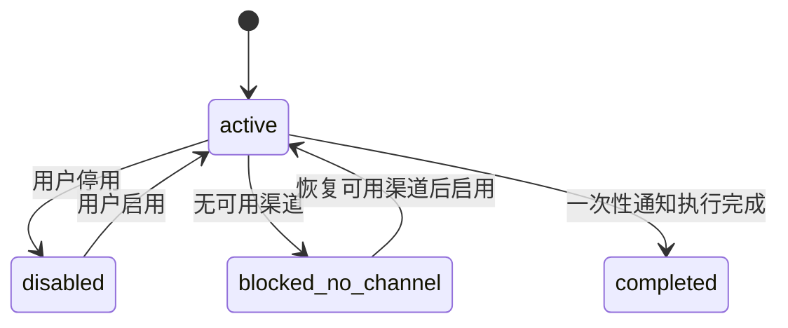

# TechnicalDesign

## 项目名称

**Notifyra**

## 1. 文档目的

本文档基于已确认的需求与产品设计，输出 Notifyra V1 的技术实现方案，覆盖系统架构、核心流程、数据模型、接口设计、任务调度、安全边界与非功能保障，用于后续开发拆解与实施。

---

## 2. 设计范围

V1 纳入范围：
- 多账号注册、登录、Token 鉴权
- 概览页
- 通知管理
- 渠道管理
- 推送记录
- 测试模块
- 个人设置
- AI 多轮创建通知
- 一次性 / 周期性 / Webhook 三类触发
- 通知级 Webhook Token
- 渠道级调用 Token

V1 不纳入范围：
- 团队协作
- 邮件转发
- NAS 日志接入
- 通用模板系统
- 用户级调用 Token
- 通知详情页“立即发送一次”

说明：
- 本文档以当前已确认产品结论为准；若需求文档与产品文档存在冲突，以最新产品确认结论为准。
- 其中两处已按最新确认落地：
  - 测试模块采用“测试通知 / 测试渠道”双入口
  - 个人设置不再包含用户级调用 Token

---

## 3. 技术目标

1. 支持个人多账号隔离，保证数据按用户维度强隔离
2. 支持三类触发方式统一执行与记录
3. 支持多渠道发送、失败重试、部分成功判定
4. 支持外部系统通过通知级或渠道级 Token 直接调用
5. 支持 AI 多轮补全后创建通知
6. 保证核心流程可观测、可追踪、可恢复

---

## 4. 总体架构

## 4.1 分层架构



## 4.2 模块职责

- Web 前端：页面展示、表单交互、Token 存储、状态管理
- API 服务：聚合业务接口、鉴权、参数校验、业务编排
- 调度器：扫描待执行一次性通知与周期性通知，投递执行任务
- Worker：消费执行任务，渲染内容、调用渠道、写入记录
- 渠道驱动层：统一封装企业微信 / 飞书 / 钉钉 / Bark / 通用 Webhook / PushPlus 的发送逻辑
- AI 编排服务：管理多轮对话、参数补齐、创建通知
- 数据库：保存业务对象、调用凭证哈希、执行记录、原始请求
- 本地数据目录：统一承载 SQLite 文件与头像等持久化资源，便于部署映射

## 4.3 建议技术选型

### 后端
- Node.js + TypeScript
- Web 框架：NestJS 或 Express + 分层结构
- ORM：Prisma / Drizzle / TypeORM 三选一，推荐 Prisma
- 调度：node-schedule
- 队列：V1 优先本地内存任务投递；如后续需要再引入 Redis 队列

### 前端
- React + TypeScript
- UI：Tailwind CSS + 组件库（如 shadcn/ui）
- 状态：React Query + 局部状态管理
- 表单：React Hook Form + Zod

### 基础设施
- 数据库：SQLite，数据库文件保存在项目根目录下的 `/data/`
- 文件存储：头像等用户上传资源保存在项目根目录下的 `/data/`
- 目录规划：
  - `/data/app.db`：SQLite 数据库文件
  - `/data/avatars/`：头像文件

说明：
- 这样便于后续 Docker 打包时通过 volume 统一映射持久化数据
- 若当前仓库已有既定技术栈，开发时应优先复用现有栈；本节仅给出 V1 推荐实现。

---

## 5. 核心领域模型

## 5.1 核心对象

- 用户：平台账号主体
- 渠道：可复用发送配置对象
- 通知：用户配置的发送任务对象
- 推送记录：一次真实执行结果
- 渠道结果：一次推送中每个渠道的结果明细
- AI 会话：AI 创建通知时的上下文载体
- Webhook 原始请求：Webhook 通知触发时的请求快照

## 5.2 关键关系



---

## 6. 关键流程设计

## 6.1 注册与登录



状态说明：
- 注册成功后直接可用
- Token 失效后前端跳转登录页
- 所有业务查询必须带 user_id 过滤

## 6.2 手动创建通知



创建规则：
- 状态默认启用
- 只在一次性/周期性下保存 next_trigger_at
- Webhook 类型不保存 next_trigger_at
- Webhook 类型生成 notification_token，并仅保存哈希值

## 6.3 AI 多轮创建通知



设计要点：
- AI 会话为状态机，不直接信任单轮结果
- 会话结束条件：通知名称、触发类型、渠道、标题、正文、触发规则全部齐全
- 可接受 AI 自动补标题，但最终结构必须完整
- 若未配置 AI，允许进入入口，但开始对话时直接提示去个人设置配置

## 6.4 一次性 / 周期性调度执行



设计要点：
- 周期性通知的 next_trigger_at 由 Cron 解析结果计算
- 为避免重复执行，通知领取需带锁或乐观并发控制
- 同一通知的一次执行生成一条 push_records 与多条 push_record_channels

## 6.5 Webhook 通知触发



设计要点：
- token 只存哈希，不明文落库
- 请求体 body JSON 可用于正文模板渲染
- 缺失字段时保留原始占位符
- 原始请求快照保存 body、请求时间、来源 IP

## 6.6 渠道直连调用



说明：
- 渠道调用是直接命中渠道能力，不依赖某条通知存在
- 该调用也应写入推送记录，但 notification_id 可为空，source 标记为 channel_api

## 6.7 测试模块



设计要点：
- 测试通知：复用通知当前配置执行一次测试，不等同于正式任务执行
- 测试渠道：只验证渠道联通性与展示效果
- 测试结果单独保留在测试视图，不混入正式统计口径；但可视情况保留审计日志
- 示例代码按入口切换：通知调用代码 / 渠道调用代码

---

## 7. 状态设计

## 7.1 通知状态

建议枚举：
- active：启用中
- disabled：手动停用
- blocked_no_channel：无可用渠道而被系统停用
- completed：一次性通知已执行完成

状态流转：



## 7.2 渠道状态
- active：启用
- disabled：停用

## 7.3 推送结果状态
- success：全部成功
- failed：全部失败
- partial_success：部分成功

## 7.4 AI 会话状态
- collecting：收集中
- ready_to_create：参数齐全
- completed：已创建
- failed：失败 / 中断

---

## 8. 数据库设计

以下以关系型数据库为例。

## 8.1 users

| 字段 | 类型 | 说明 |
|---|---|---|
| id | bigint / uuid | 主键 |
| username | varchar(64) unique | 用户名，唯一 |
| password_hash | varchar(255) | 密码哈希 |
| avatar_url | varchar(255) null | 头像地址 |
| created_at | datetime | 创建时间 |
| updated_at | datetime | 更新时间 |

设计理由：
- 用户名唯一约束放数据库层，避免并发注册重复
- 密码仅存哈希，不存明文

## 8.2 user_settings

| 字段 | 类型 | 说明 |
|---|---|---|
| id | bigint / uuid | 主键 |
| user_id | fk | 用户ID |
| ai_base_url | varchar(255) null | AI Base URL |
| ai_api_key_encrypted | text null | 加密后的 AI Key |
| ai_model | varchar(128) null | 模型名 |
| afternoon_time | varchar(8) null | 下午默认时间 |
| evening_time | varchar(8) null | 晚上默认时间 |
| tomorrow_morning_time | varchar(8) null | 明早默认时间 |
| created_at | datetime | 创建时间 |
| updated_at | datetime | 更新时间 |

设计理由：
- 用户偏好与账号拆表，便于扩展个人配置
- AI Key 需要加密存储，不只做脱敏

## 8.3 channels

| 字段 | 类型 | 说明 |
|---|---|---|
| id | bigint / uuid | 主键 |
| user_id | fk | 所属用户 |
| name | varchar(100) | 渠道名称 |
| type | varchar(32) | 渠道类型 |
| config_json | json | 渠道配置 |
| status | varchar(20) | active / disabled |
| retry_count | tinyint | 0-3 |
| call_token_hash | varchar(255) | 渠道调用 token 哈希 |
| last_used_at | datetime null | 最近使用时间 |
| created_at | datetime | 创建时间 |
| updated_at | datetime | 更新时间 |

设计理由：
- 不同渠道配置差异大，使用 config_json 保存
- token 只存哈希，避免泄露后可逆恢复

## 8.4 notifications

| 字段 | 类型 | 说明 |
|---|---|---|
| id | bigint / uuid | 主键 |
| user_id | fk | 所属用户 |
| name | varchar(100) | 通知名称 |
| trigger_type | varchar(20) | one_time / recurring / webhook |
| title | varchar(100) | 标题 |
| content | varchar(500) | 正文 |
| content_mode | varchar(20) | plain / webhook_template |
| schedule_at | datetime null | 一次性触发时间 |
| cron_expr | varchar(100) null | 周期表达式 |
| next_trigger_at | datetime null | 下次触发时间 |
| status | varchar(32) | 通知状态 |
| stop_reason | varchar(255) null | 停止原因 |
| created_by | varchar(20) | manual / ai |
| webhook_token_hash | varchar(255) null | Webhook token 哈希 |
| created_at | datetime | 创建时间 |
| updated_at | datetime | 更新时间 |

设计理由：
- 三类触发共用一张表，减少跨表查询复杂度
- schedule_at / cron_expr / webhook_token_hash 按触发类型条件使用
- stop_reason 单独保留，支持“无可用渠道”原因展示

## 8.5 notification_channels

| 字段 | 类型 | 说明 |
|---|---|---|
| id | bigint / uuid | 主键 |
| notification_id | fk | 通知ID |
| channel_id | fk | 渠道ID |
| created_at | datetime | 创建时间 |

约束：
- unique(notification_id, channel_id)

## 8.6 push_records

| 字段 | 类型 | 说明 |
|---|---|---|
| id | bigint / uuid | 主键 |
| user_id | fk | 用户ID |
| notification_id | fk null | 通知ID，可为空 |
| source | varchar(32) | scheduler / webhook / test_notification / test_channel / channel_api |
| trigger_snapshot_json | json null | 触发快照 |
| title_snapshot | varchar(100) | 本次发送标题 |
| content_snapshot | varchar(1000) | 本次发送正文快照 |
| result | varchar(32) | success / failed / partial_success |
| error_summary | varchar(500) null | 汇总错误 |
| pushed_at | datetime | 推送时间 |
| created_at | datetime | 创建时间 |

设计理由：
- 标题和正文按快照保存，避免通知后续修改导致历史失真
- notification_id 允许为空，以支持渠道级调用与测试渠道

## 8.7 push_record_channels

| 字段 | 类型 | 说明 |
|---|---|---|
| id | bigint / uuid | 主键 |
| push_record_id | fk | 推送记录ID |
| channel_id | fk | 渠道ID |
| channel_name_snapshot | varchar(100) | 渠道名快照 |
| channel_type_snapshot | varchar(32) | 渠道类型快照 |
| result | varchar(32) | success / failed |
| error_message | varchar(500) null | 失败原因 |
| retry_attempts | tinyint | 实际重试次数 |
| created_at | datetime | 创建时间 |

## 8.8 webhook_request_logs

| 字段 | 类型 | 说明 |
|---|---|---|
| id | bigint / uuid | 主键 |
| push_record_id | fk | 关联推送记录 |
| notification_id | fk | 通知ID |
| source_ip | varchar(64) | 来源 IP |
| request_body_json | json | 请求体 |
| requested_at | datetime | 请求时间 |
| created_at | datetime | 创建时间 |

## 8.9 ai_sessions

| 字段 | 类型 | 说明 |
|---|---|---|
| id | bigint / uuid | 主键 |
| user_id | fk | 用户ID |
| status | varchar(32) | collecting / ready_to_create / completed / failed |
| collected_params_json | json | 已收集参数 |
| message_history_json | json | 会话历史 |
| created_notification_id | fk null | 已创建通知 |
| created_at | datetime | 创建时间 |
| updated_at | datetime | 更新时间 |

---

## 9. 接口设计

接口统一前缀建议：`/api/v1`

## 9.1 鉴权接口

### POST /auth/register
- 页面：注册页
- 入参：username, password
- 逻辑：校验长度与唯一性，创建用户与默认设置
- 出参：userId

### POST /auth/login
- 页面：登录页
- 入参：username, password
- 逻辑：校验密码，签发 Token
- 出参：accessToken, userInfo

### GET /auth/me
- 页面：全局
- 逻辑：返回当前登录用户信息

## 9.2 概览接口

### GET /dashboard/overview
- 页面：概览页
- 出参：
  - notificationCount
  - successCount
  - failedCount
  - recentRecords[]
- 说明：统计口径固定，例如最近 7 天

## 9.3 通知接口

### GET /notifications
- 页面：通知列表
- 参数：keyword, triggerType, status, page, pageSize
- 出参：通知分页列表

### POST /notifications
- 页面：新建通知
- 入参：
  - name
  - triggerType
  - channelIds[]
  - title
  - content
  - contentMode
  - scheduleAt?
  - cronExpr?
- 逻辑：按类型校验并创建通知

### GET /notifications/:id
- 页面：通知详情
- 出参：基础信息、渠道信息、最近 10 条记录、Webhook 信息（条件返回）

### PUT /notifications/:id
- 页面：通知编辑
- 逻辑：更新通知并重算 nextTriggerAt

### PATCH /notifications/:id/status
- 页面：通知列表 / 详情
- 入参：status
- 逻辑：启停通知；启用前校验至少存在一个可用渠道

### DELETE /notifications/:id
- 页面：通知列表 / 详情
- 逻辑：逻辑删除或物理删除，需同步解绑关联

### POST /notifications/:id/webhook-token/reset
- 页面：通知详情
- 逻辑：重置 Webhook token，返回新 token 明文一次

## 9.4 渠道接口

### GET /channels
- 页面：渠道列表
- 参数：keyword, type, status, page, pageSize

### POST /channels
- 页面：新增渠道
- 入参：name, type, configJson, retryCount
- 逻辑：创建渠道并生成 call token

### GET /channels/:id
- 页面：渠道详情
- 出参：基础信息、关联通知、调用路径信息

### PUT /channels/:id
- 页面：渠道编辑

### PATCH /channels/:id/status
- 页面：渠道列表 / 详情
- 逻辑：停用后检查受影响通知，必要时将通知置为 blocked_no_channel

### DELETE /channels/:id
- 页面：渠道列表 / 详情
- 逻辑：若仍被通知引用则拒绝删除

### POST /channels/:id/call-token/reset
- 页面：渠道详情
- 逻辑：重置 call token，返回新 token 明文一次

## 9.5 推送记录接口

### GET /push-records
- 页面：推送记录列表
- 参数：result, notificationId, dateFrom, dateTo, keyword, page, pageSize

### GET /push-records/:id
- 页面：推送记录详情
- 出参：基础信息、渠道结果、Webhook 原始请求（条件返回）

## 9.6 测试模块接口

### POST /test/notification/:id/send
- 页面：测试模块-测试通知
- 逻辑：读取通知当前配置进行测试
- 备注：不计入正式统计

### POST /test/channel/:id/send
- 页面：测试模块-测试渠道
- 入参：title, content
- 逻辑：只测试指定渠道

### GET /test/sample-code
- 页面：测试模块
- 参数：type=notification|channel, targetId, language
- 出参：示例代码文本

## 9.7 个人设置接口

### GET /settings/profile
- 页面：个人设置

### PUT /settings/profile
- 页面：个人设置
- 入参：avatarUrl?

### PUT /settings/password
- 页面：个人设置
- 入参：currentPassword, newPassword

### GET /settings/preferences
- 页面：个人设置

### PUT /settings/preferences
- 页面：个人设置
- 入参：afternoonTime, eveningTime, tomorrowMorningTime

### GET /settings/ai
- 页面：个人设置

### PUT /settings/ai
- 页面：个人设置
- 入参：baseUrl, apiKey, model

### POST /settings/ai/test
- 页面：个人设置
- 逻辑：测试 AI 配置连通性

## 9.8 AI 接口

### POST /ai/sessions
- 页面：新建通知页-AI 区
- 逻辑：创建会话并返回首轮响应

### POST /ai/sessions/:id/messages
- 页面：新建通知页-AI 区
- 入参：message
- 逻辑：推进多轮会话，必要时直接落通知

### GET /ai/sessions/:id
- 页面：AI 创建页
- 逻辑：恢复当前会话状态

## 9.9 外部调用接口

### POST /open/webhook/notify/:token
- 用途：通知级 Webhook 触发
- 鉴权：token 即凭证
- 备注：只允许命中 webhook 类型通知

### POST /open/channel/call/:token
- 用途：渠道级直接调用
- 鉴权：token 即凭证
- 入参：title, content

---

## 10. 渠道驱动设计

统一接口：

```ts
interface ChannelDriver {
  send(input: {
    channelConfig: Record<string, unknown>
    title: string
    content: string
  }): Promise<{
    success: boolean
    errorMessage?: string
  }>
}
```

驱动列表：
- wecomWebhookDriver
- feishuWebhookDriver
- dingtalkWebhookDriver
- barkDriver
- genericWebhookDriver
- pushPlusDriver

设计原则：
- 统一入参输出，屏蔽上层业务差异
- 每个驱动内部处理各平台 HTTP 请求格式
- 渠道错误返回标准化 errorMessage
- retry 由 Worker 控制，不放到驱动内部无限重试

---

## 11. 调度与重试设计

## 11.1 调度策略
- 每分钟扫描一次一次性与周期性通知
- 查询条件：status=active 且 next_trigger_at <= now
- 采用批量分页扫描，避免长事务

## 11.2 防重复执行
- 扫描后先将任务标记为 executing 或写入独立 job 表
- 使用数据库乐观锁或 `for update skip locked`
- Worker 完成后再更新 next_trigger_at 或 completed 状态

## 11.3 重试策略
- 读取渠道 retry_count
- 单渠道失败时最多重试 3 次
- 重试采用短退避，如 0s / 10s / 30s
- 记录实际 retry_attempts

## 11.4 部分成功判定
- 全部成功 => success
- 全部失败 => failed
- 至少一个成功且至少一个失败 => partial_success

---

## 12. 模板渲染设计

## 12.1 适用范围
- 仅 Webhook 类型通知
- 仅正文 content 支持模板
- 仅支持 body JSON 路径

## 12.2 渲染规则
- 模板格式：`{{body.xxx}}`
- 根据 JSON path 读取字段
- 字段不存在时保留原始占位符
- 不支持表达式执行，不支持函数调用

## 12.3 安全限制
- 不执行任意脚本
- 不允许访问请求头/query/系统变量
- 模板解析器只做白名单语法替换

---

## 13. 安全设计

## 13.1 鉴权与隔离
- 所有业务接口必须校验登录 Token
- 所有查询和更新必须带 user_id 条件
- 外部开放接口只使用 token，不复用登录 Token

## 13.2 密钥与 Token 保护
- 用户密码哈希存储
- AI API Key 加密存储
- Webhook Token / 渠道 Token 仅生成时明文返回一次，数据库只存哈希
- 日志中禁止打印敏感 token 与 key

## 13.3 输入校验
- 后端统一校验字段长度、枚举值、Cron 格式
- Webhook body 限制大小，避免超大请求
- 标题与正文长度分别限制 100 / 500

## 13.4 防滥用
- 登录接口限流
- 开放 token 接口限流
- token 重置后旧 token 立刻失效

## 13.5 审计与追踪
- 关键操作写操作日志或最小审计记录：
  - 登录
  - 重置通知 Token
  - 重置渠道 Token
  - 启停通知
  - 启停渠道

---

## 14. 非功能设计保证

## 14.1 可用性
- API、Worker、调度器拆分运行
- 队列削峰，避免瞬时发送阻塞接口
- 失败任务保留结果，便于追查

## 14.2 性能
- 列表接口使用分页
- 推送记录列表默认只查最近 10 条或分页窗口
- 概览统计按固定时间窗口并可缓存短期结果

## 14.3 可维护性
- 渠道驱动层统一抽象
- 业务模块按 auth / notify / channel / record / test / settings / ai 分层
- 统一错误码与响应结构

## 14.4 可扩展性
- 新增渠道只需新增 driver 与渠道配置 schema
- NAS / 邮件转发后续可作为新触发源或新渠道扩展
- 团队能力后续可在 user 之上增加 organization 维度

## 14.5 可观测性
- 记录任务投递数、发送成功率、失败率、平均延迟
- 关键链路打点：调度扫描、Webhook 调用、渠道发送、AI 对话落库

---

## 15. 页面与接口映射

| 页面 | 主要接口 |
|---|---|
| 登录/注册 | /auth/register, /auth/login, /auth/me |
| 概览 | /dashboard/overview |
| 通知列表 | /notifications |
| 新建/编辑通知 | /notifications, /notifications/:id, /ai/sessions |
| 通知详情 | /notifications/:id, /notifications/:id/webhook-token/reset |
| 渠道列表 | /channels |
| 渠道详情 | /channels/:id, /channels/:id/call-token/reset |
| 推送记录列表 | /push-records |
| 推送记录详情 | /push-records/:id |
| 测试模块 | /test/notification/:id/send, /test/channel/:id/send, /test/sample-code |
| 个人设置 | /settings/profile, /settings/password, /settings/preferences, /settings/ai |

---

## 16. 开发拆解建议

### 阶段一：基础能力
- 用户注册登录
- 用户设置
- 渠道管理

### 阶段二：通知核心
- 通知 CRUD
- 通知与渠道绑定
- 一次性 / 周期性调度

### 阶段三：执行与记录
- Worker 执行
- 多渠道结果记录
- 推送记录详情

### 阶段四：开放调用
- Webhook 通知触发
- 渠道直连调用
- Token 重置

### 阶段五：AI 与测试
- AI 多轮创建
- 测试模块
- 示例代码生成

---

## 17. 风险与注意事项

1. 需求文档与产品文档存在少量历史不一致，开发前应以已确认产品结论统一口径
2. Cron 解析、时区与 next_trigger_at 计算容易出错，需要单元测试覆盖
3. token 一次性明文返回会影响前端交互设计，需在 UI 明确提示保存
4. 渠道配置差异较大，driver 层需要严格标准化
5. AI 多轮创建涉及外部模型不稳定性，需要会话超时与失败兜底提示

---

## 18. 结论

Notifyra V1 技术方案应采用“前端 + API 服务 + 调度器 + Worker + 渠道驱动 + 关系型数据库 + Redis 队列”的结构，以通知、渠道、推送记录为核心，围绕三类触发方式与双类外部调用能力展开实现。该方案能够覆盖当前 V1 需求，并为后续新增渠道、NAS 模块、团队能力提供扩展空间。
